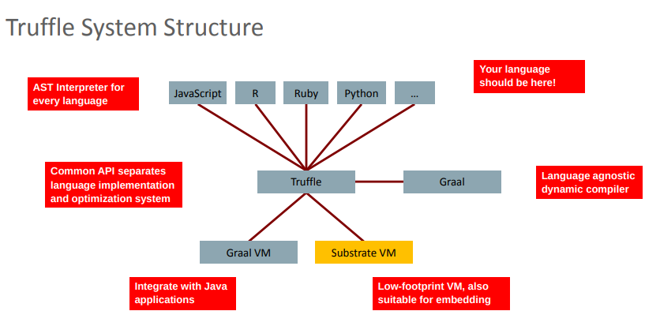

So… should you use a JVM + Graal, or should you use SubstrateVM?

# [SubstrateVM](https://www.oracle.com/technetwork/java/jvmls2015-wimmer-2637907.pdf) (SVM)

Pros:

* self-contained native executables | бие даасан native гүйцэтгэгч
    
* fast process start 
    
* smaller memory footprint | Санах ойн хэмжээ бага
    
* smaller executable footprint 

Cons:

* no JIT compiler, so lesser peak performance | JIT хөрвүүлэгч байхгүй тул хамгийн бага гүйцэтгэлтэй

* simple garbage-collector 

* not all JVM code easily compiles, and when it does, you may still have surprises at runtime. | Бүх JVM кодыг хялбархан эмхэтгэдэггүй бөгөөд үүнийг хийх үед ажиллах үед гэнэтийн алдаанууд үүсэдэг.

`Best use-cases:`

* command-line tools

* embedded / constrained devices (note: ARM is not supported for SVM yet)

* containerized environments where raw performance is not the main concern | raw performance нь гол асуудал биш container орчинд

# JVM + Graal JIT compiler

Pros:

* it’s still a regular JVM

* combine Graal with the best GC for your workload | Хамгийн сайн Garbage Collector-той хосолдог

* excellent peak performance. | өндөр түвшний гүйцэтгэл 

Cons:

* traditional footprint of a JVM | Уламжилалт JVM

* JVM startup times | JVM эхлүүлэх хугацаа

* requires more iterations than C2 to reach peak performance, un-tiered compilation (e.g., Graal without C1) is slower until Graal kicks-in. | дээд гүйцэтгэлд хүрэхийн тулд C2-ээс илүү олон давталт шаарддаг, un-tiered compilation(жишээ нь, C1-гүй Graal) нь Graal-ийг эхлүүлэх хүртэл удаан байдаг.

`Best use-cases:`

* services, networked services, micro-services,

* data processing applications where performance is critical | Өгөгдөл боловсруулах app-ыйн performance - д чухал байдаг
 
* alternative JVM languages. | JVM - д суурилсан хэлүүдэд ашигладаг

## JVM нь уламжлал ёсоор Hotspot JIT хөрвүүлэгчийг ашигладаг бөгөөд энэ нь 2 хөрвүүлэгчээс бүрддэг:

* C1 нь энгийн native кодыг гаргадаг, боловч interpreter дээр байт кодыг гүйцэтгэхээс илүү хурдан байдаг. 

* C2 нь илүү aggressive хөрвүүлэгч бөгөөд гүйцэтгэлийн профайл дээр тулгуурлан илүү сайн native код үүсгэдэг боловч ихэнхдээ оновчгүй болгодог.

C2 нь гүйцэтгэлийг өгдөг хөрвүүлэгч боловч C++ хэл дээр бичигдсэн хуучирсан, complex кодын суурь юм. Ойлгох хүн цөөхөн байдаг

## GraalVM is not just Substrate VM

Graal бол code generator, SubstrateVM бол зөвхөн нэг хэсэг нь юм.

Томоохон GraalVM төсөлд п/хэл хоорондын харилцан ажиллах платформ гэх мэт олон зүйл бий, JavaScript / R / Ruby-ийн хурдан хэрэгжилт, native кодыг гүйцэтгэх, interpreters бүтээхэд зориулсан Truffle гэх мэт.

